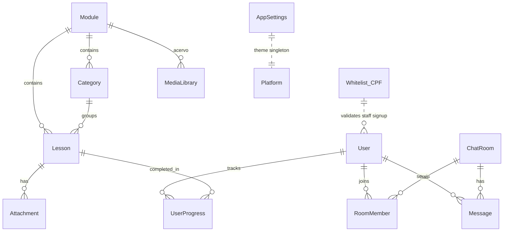

# 2. Modelagem de dados (MySQL)

Implementação: `backend/prisma/schema.prisma`. Migrações em `backend/prisma/migrations/`.

## 2.1 Diagrama lógico

## 2.2 Tabelas essenciais

### Users e staff

| Campo | Tipo | Notas |
|-------|------|--------|
| `User.id` | UUID | PK |
| `User.email` | unique | Login |
| `User.username` | unique, optional | Chat / leaderboard |
| `User.passwordHash` | string | bcrypt |
| `User.dob` | datetime | Obrigatório no cadastro |
| `User.role` | enum STUDENT/TEACHER/ADMIN | Default STUDENT |
| `User.cpfHash` | string?, unique | Apenas staff; hash SHA-256 do CPF normalizado |
| `User.isBanned` | boolean | Admin |

### Whitelist_CPF

| Campo | Tipo | Notas |
|-------|------|--------|
| `cpf` | PK (11 dígitos) | Sem pontuação |
| `role` | TEACHER ou ADMIN | Atribuído no cadastro staff |

CPFs autorizados são gerenciados pelo admin (`/api/admin/whitelist`). Não expor a lista publicamente.

### CMS — AppSettings

Singleton: `themeColor`, `logoUrl`, `updatedAt`.

### Currículo

| Entidade | Função |
|----------|--------|
| **Module** | 10 módulos principais; `orderIndex` para drag-and-drop |
| **Category** | Subdivisões dentro do módulo (ex.: unidades temáticas) |
| **Lesson** | Conteúdo textual, `videoUrl` externo (YouTube/Vimeo) |
| **Attachment** | PDF/áudio/imagem ligados à aula (`orderIndex`) |
| **MediaLibrary** | Acervo multimídia independente ou ligado ao módulo 6 |

### Gamificação

**UserProgress** — chave composta `(userId, lessonId)`: `isCompleted`, `score`, `completedAt`.

### Chat

| Entidade | Função |
|----------|--------|
| **ChatRoom** | `PRIVATE` ou `GROUP` |
| **RoomMember** | PK `(userId, chatRoomId)` |
| **Message** | texto + opcional `mediaUrl` / `mediaType` (max 20 MB) |

## 2.3 Mapeamento escopo → modelo

| Requisito do prompt | Modelo |
|---------------------|--------|
| Categories | `Category` |
| MediaLibrary | `MediaLibrary` |
| Lessons / PDFs | `Lesson` + `Attachment` |
| ChatRooms / RoomMembers / Messages | homônimos |

## 2.4 Índices recomendados (futuro)

- `Message(chatRoomId, createdAt)` — paginação do histórico.
- `UserProgress(userId)` — dashboard do aluno.
- `Lesson(moduleId, orderIndex)` — listagem curricular.

## 2.5 Seed curricular

O script `backend/prisma/seed.ts` cria os **10 módulos** na ordem pedagógica:

1. Ponto de Partida  
2. Alicerces  
3. Espanhol Cotidiano  
4. Conectando Culturas  
5. Vida Profissional  
6. Acervo Multimídia  
7. Desarmando o Portunhol  
8. Clube de Leitura  
9. Desafios em Rede  
10. Encerramento  

Executar: `npx prisma db seed` (após configurar `DATABASE_URL`).
