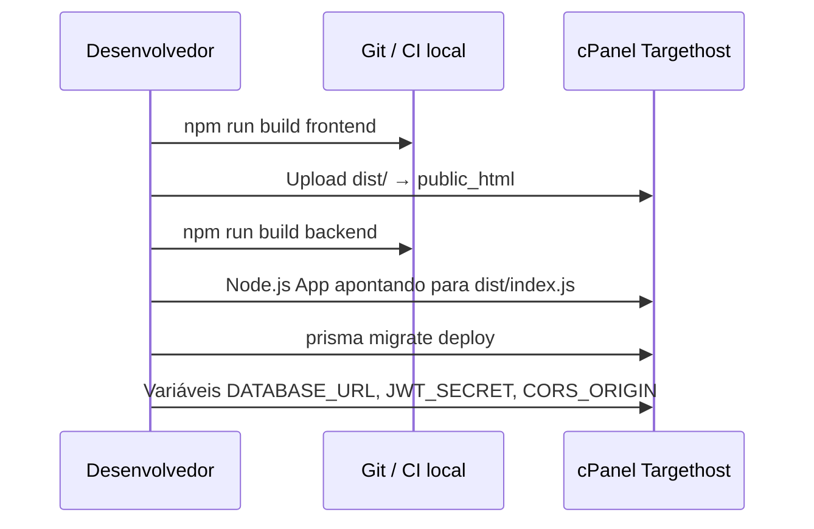

# 4. Deploy Targethost, mídia e PWA

## 4.1 Fluxo de deploy



### Front-end (estático)

1. `cd frontend && npm ci && npm run build`
2. Conteúdo de `frontend/dist/` → `public_html/` (ou subpasta).
3. Copiar `deploy/public_html.htaccess` → `public_html/.htaccess` (SPA fallback).

### Back-end (Node.js)

1. `cd backend && npm ci && npx prisma generate && npm run build && npx prisma migrate deploy`
   - **Prisma 7 exige driver adapter** — o client é gerado em `src/generated/prisma` e compilado junto no build (não use o `prisma-client-js` legado).
   - ⚠️ **Não use `npm ci --omit=dev`**: o `prisma` (CLI) é devDependency e o `postinstall` roda `prisma generate` — sem dev deps a instalação falha.
2. No cPanel **Setup Node.js App**:
   - Application root: pasta do backend
   - Application startup file: `dist/index.js`
   - Mode: production
   - Node.js 20.19+ (requisito do Prisma 7)
3. Mapear subdomínio `api.seudominio.com.br` para a app (ou reverse proxy `/api`).

Exemplo de proxy Apache (ajustar porta): ver `deploy/api-proxy.conf.example`.

### Uploads persistentes

Diretório `backend/uploads/` deve ficar **fora** de deploys que apagam arquivos, ou ser backup periódico:

```
uploads/
  attachments/   # PDFs e áudios de aula
  chat/            # Anexos de mensagens
  branding/        # Logo CMS
  avatars/         # Fotos de perfil
  media/           # Acervo MediaLibrary
```

Permissões: `755` diretórios, `644` arquivos; dono = usuário da app Node.

## 4.2 Estratégia de vídeo (aulas pesadas)

**Não hospedar vídeos longos no disco do cPanel.**

| Abordagem | Uso |
|-----------|-----|
| **YouTube / Vimeo não listado** | Campo `Lesson.videoUrl` e `MediaLibrary.videoUrl` — embed no front |
| **CDN externa barata** (Bunny, Cloudflare Stream) | Se precisar URL própria; `videoUrl` aponta para HLS/DASH |
| **Arquivos locais** | Apenas trailers curtos (< ~50 MB); não recomendado para biblioteca completa |

Entrega: `<iframe>` ou player HLS no React; PWA **não** cacheia vídeo inteiro por padrão (economia de quota Cache API).

## 4.3 PWA e offline

Arquivos:

- `frontend/public/manifest.json` — instalabilidade
- `frontend/public/sw.js` — cache versionado
- Registro em `frontend/src/main.tsx`

### Política de cache (Service Worker)

| Recurso | Estratégia |
|---------|------------|
| Shell SPA (`index.html`, JS/CSS build) | Cache-first após install |
| `GET /api/settings` | Stale-while-revalidate (tema offline) |
| PDF/áudio de aula | Cache-on-demand via mensagem `CACHE_LESSON_ASSET` |
| API autenticada / chat | Network-only |
| Vídeos embed | Network-only |

### Materiais offline no app

Após abrir uma aula, o front pode chamar:

```javascript
navigator.serviceWorker.controller?.postMessage({
  type: 'CACHE_LESSON_ASSET',
  url: 'https://api.../uploads/attachments/uuid.pdf'
});
```

Quota: orientar usuário a baixar só PDFs/áudios leves; limpar cache na desinstalação/atualização (`CACHE_NAME` bump).

## 4.4 Segurança em produção

- `JWT_SECRET` forte; **o app falha no boot se estiver ausente em produção** (fail-fast no `index.ts`)
- `CORS_ORIGIN` = domínio exato do front
- HTTPS obrigatório (Let's Encrypt no cPanel)
- Rate limit já ativo em `/auth/login` e `/auth/register` (20 req/15 min por IP, com `trust proxy` habilitado)
- Backups MySQL via cPanel + snapshots de `uploads/`

## 4.5 Checklist pós-deploy

- [ ] `GET /api/health` responde 200
- [ ] Login e JWT funcionam
- [ ] WebSocket conecta (aba Network → WS ou polling)
- [ ] Upload 20 MB no chat e anexo de aula
- [ ] `manifest.json` + ícones 192/512
- [ ] Lighthouse PWA: instalável
