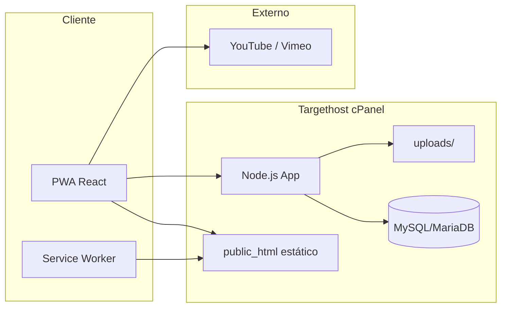

# Espanhol em Rede: Conectando Saberes — Documentação Técnica

Plataforma web gratuita de ensino de espanhol com progressão gamificada (estilo Duolingo) e chat comunitário (estilo Tandem), hospedada na **Targethost** (cPanel + Node.js + MySQL).

## Índice

| Documento | Conteúdo |
|-----------|----------|
| [01-stack-tecnologica.md](./01-stack-tecnologica.md) | Front estático (React/Vite), API Node.js, Prisma, Socket.IO |
| [02-modelagem-dados.md](./02-modelagem-dados.md) | ER lógico, tabelas, RBAC, privacidade do aluno |
| [03-api-rest-e-realtime.md](./03-api-rest-e-realtime.md) | Rotas REST, eventos WebSocket, códigos de erro |
| [04-deploy-targethost-pwa.md](./04-deploy-targethost-pwa.md) | cPanel, vídeos, uploads, Service Worker, cache |
| [05-analise-gaps.md](./05-analise-gaps.md) | O que já existe no repositório vs. escopo e próximos passos |

## Estrutura do repositório

```
Projeto Espanhol/
├── frontend/          # React 19 + Vite 8 — build → public_html
├── backend/           # Express 5 + Prisma 7 + Socket.IO — app Node no cPanel
├── docs/              # Esta documentação
└── deploy/            # Exemplos .htaccess e proxy para produção
```

## Visão rápida de arquitetura



## Contato com o código

- Schema: `backend/prisma/schema.prisma`
- Entrada da API: `backend/src/index.ts`
- Tempo real: `backend/src/socket.ts`
- Seed curricular (10 módulos): `backend/prisma/seed.ts`
